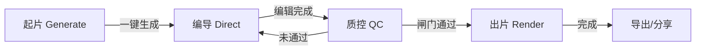

# 3C Review Video Studio — Design System v2

> 暗色专业工具风 · 导演台/影院气质 · 对标 DaVinci Resolve / Frame.io 信息密度  
> 技术栈：Vite + Preact · CSS 变量（`--ds-*`）· 渐进迁移自 legacy `styles.css`

---

## 1. 设计原则

| 原则 | 说明 |
|------|------|
| **导演台优先** | 一句话起片是入口，时间线是主舞台，右侧检视器随选中镜头变化 |
| **暗色沉浸** | 深空黑底 + 粉紫蓝霓虹渐变强调，减少眼疲劳，突出内容区 |
| **信息密度** | 专业工具感：紧凑 metrics、可折叠高级区、横向时间线一屏可见全片结构 |
| **渐进迁移** | `ds-` 新类与 legacy 类并存；tokens 提供 `--bg`/`--accent` 别名 |

---

## 2. Design Tokens

### 2.1 色彩

| Token | CSS 变量 | 值 | 用途 |
|-------|----------|-----|------|
| Background | `--ds-bg` | `#08080f` | 页面底色 |
| Panel | `--ds-panel` | `rgba(22,22,33,0.72)` | 卡片/面板 |
| Panel 2 | `--ds-panel-2` | `rgba(30,30,45,0.7)` | 输入框底 |
| Soft | `--ds-soft` | `rgba(255,255,255,0.045)` | 次级按钮/指标底 |
| Ink | `--ds-ink` | `#eef0f6` | 主文字 |
| Muted | `--ds-muted` | `#9aa0b4` | 辅助文字/标签 |
| Line | `--ds-line` | `rgba(255,255,255,0.10)` | 边框 |
| Accent | `--ds-accent` | `#b16bff` | 品牌紫 |
| Accent Grad | `--ds-accent-grad` | `linear-gradient(135deg,#ff4d9d,#b16bff 52%,#6f7bff)` | CTA/品牌标记 |
| Accent Soft | `--ds-accent-soft` | `rgba(177,107,255,0.16)` | 焦点环/高亮底 |
| Success | `--ds-success` | `#34d399` | 质检通过 |
| Warning | `--ds-warning` | `#fbbf24` | 留人分中等 |
| Danger | `--ds-danger` | `#ff6b6b` | 质检拦下/删除 |
| Info | `--ds-info` | `#7aa2ff` | 链接/信息 |

**氛围渐变**（`body` 背景层）：

```css
--ds-bg-gradient:
  radial-gradient(900px 600px at 12% -10%, rgba(255,77,157,0.16), transparent 60%),
  radial-gradient(1000px 700px at 100% 0%, rgba(111,123,255,0.16), transparent 55%),
  radial-gradient(800px 600px at 50% 110%, rgba(177,107,255,0.14), transparent 60%);
```

### 2.2 字体

| Token | 值 | 用途 |
|-------|-----|------|
| `--ds-font-sans` | Inter, system-ui, "Microsoft YaHei", sans-serif | 全局 |
| `--ds-font-mono` | ui-monospace, Cascadia Code, Menlo | JSON/代码 |
| `--ds-text-xs` | 11px | 角标/时间码 |
| `--ds-text-sm` | 12px | 标签/辅助 |
| `--ds-text-base` | 13px | 正文默认 |
| `--ds-text-md` | 16px | 区块标题 |
| `--ds-text-lg` | 18px | 起片输入/指标数 |
| `--ds-text-xl` | 19px | TopBar 标题 |

字重：`400` 正文 · `600` 标签 · `700` 按钮/标题 · `800` 品牌标记

### 2.3 间距

| Token | 值 | 典型场景 |
|-------|-----|----------|
| `--ds-space-1` | 4px | 紧凑内边距 |
| `--ds-space-2` | 6px | 分段控件间隙 |
| `--ds-space-3` | 8px | 工具栏按钮间距 |
| `--ds-space-4` | 10px | 表单网格 |
| `--ds-space-5` | 12px | 区块内边距 |
| `--ds-space-6` | 14px | 折叠块 |
| `--ds-space-7` | 16px | 面板/导演台 gap |
| `--ds-space-8` | 18px | 起片输入水平 padding |
| `--ds-space-9` | 22px | StageBar padding |
| `--ds-space-10` | 28px | 主 CTA 水平 padding |

### 2.4 圆角

| Token | 值 | 场景 |
|-------|-----|------|
| `--ds-radius-sm` | 6px | Segment、资产缩略图 |
| `--ds-radius-md` | 8px | 按钮、输入框、指标卡 |
| `--ds-radius-lg` | 12px | 折叠块、预览区 |
| `--ds-radius-xl` | 16px | Panel |
| `--ds-radius-2xl` | 18px | StageBar、Modal |
| `--ds-radius-pill` | 999px | StatusPill |

### 2.5 阴影与模糊

| Token | 值 | 场景 |
|-------|-----|------|
| `--ds-shadow` | `0 18px 50px rgba(0,0,0,0.45)` | Panel |
| `--ds-shadow-accent` | `0 10px 28px rgba(177,107,255,0.4)` | 主 CTA |
| `--ds-blur-panel` | `blur(14px)` | 毛玻璃面板 |
| `--ds-blur-topbar` | `blur(16px)` | 顶栏 |
| `--ds-focus-ring` | `0 0 0 3px var(--ds-accent-soft)` | 输入焦点 |

### 2.6 布局常量

| Token | 值 |
|-------|-----|
| `--ds-topbar-height` | 76px |
| `--ds-director-max` | 1180px |
| `--ds-cue-height` | 56px |

**代码位置**：`src/design/tokens.css`（CSS）· `src/design/tokens.js`（JS 导出）

---

## 3. 四段式信息架构（IA）

用户旅程分为四个阶段，对应顶部 Phase Tab 或纵向 Flow 步骤：

```
┌─────────────────────────────────────────────────────────────────┐
│  TopBar: 品牌 · API 状态 · 全局操作                              │
├─────────────────────────────────────────────────────────────────┤
│  [ 起片 ]  [ 编导 ]  [ 质控 ]  [ 出片 ]     ← Phase 导航         │
├─────────────────────────────────────────────────────────────────┤
│                                                                 │
│   （各 Phase 主内容区，见下方线框）                                │
│                                                                 │
└─────────────────────────────────────────────────────────────────┘
```

### Phase 1 · 起片（Generate）

**目标**：一句话输入产品名 → 自动知乎搜索 → MiMo 生成分镜

```
┌─ StageBar（渐变描边 Panel）────────────────────────────────────┐
│  [ 产品名输入 ─────────────────────── ] [一键生成] [高级设置]      │
│  hint: 自动知乎搜索 → 抓取素材 → MiMo 分镜                        │
│  ┌─ adv-panel（折叠）─────────────────────────────────────────┐ │
│  │ 品类 | 时长 | 平台 | 音色                                    │ │
│  │ 克隆音色 details · 素材上传 · 布局 segment                   │ │
│  └────────────────────────────────────────────────────────────┘ │
└─────────────────────────────────────────────────────────────────┘
```

**关键组件**：`StageBar` · `FieldGrid` · `SegmentGroup` · `UploadZone` · `Collapsible`

### Phase 2 · 编导（Direct）

**目标**：横向时间线总览 + 分镜卡编辑 + 右侧画面预览

```
┌─ Console Panel ────────────────────────────────────────────────┐
│  Metrics: 镜头数 | 总时长 | 平台          Toolbar: 重生/新增/导出 │
├──────────────────────────────────────────────────────────────────┤
│  TimelineTrack（横向标尺 + 色块条）                               │
│  ├──[S1 12s]──[S2 8s]──[S3 15s]──[S4 ...]──►                    │
├──────────────────────────────┬───────────────────────────────────┤
│  ClipCard 列表（纵向）        │  Inspector + Preview              │
│  ┌─ Scene 01 ─────────────┐ │  ┌─ 画面预览 9:16 ─────────────┐  │
│  │ 口播/字幕/视觉类型       │ │  │                             │  │
│  │ [编辑] [TTS试听]        │ │  └─────────────────────────────┘  │
│  └────────────────────────┘ │  参数卡 · 素材 · 布局             │
│  ┌─ Scene 02 ─────────────┐ │                                   │
│  └────────────────────────┘ │                                   │
└──────────────────────────────┴───────────────────────────────────┘
```

**关键组件**：`TimelineTrack` · `ClipCard` · `Inspector` · `Metrics` · `SectionHead`

### Phase 3 · 质控（QC）

**目标**：留人体检 + 出片前质检闸门

```
┌─ QC Toolbar ───────────────────────────────────────────────────┐
│  [留人体检]  [出片质检]  StatusPill: 综合分 78 · 待修复 2 项      │
├──────────────────────────────────────────────────────────────────┤
│  Modal: CheckupCard                                            │
│  ┌─ 环形总分 ─┬─ 维度条：钩子/节奏/信息密度/事实 ─────────────┐  │
│  │    78     │  弱钩子 Scene 3 · 拖节奏 Scene 7              │  │
│  └───────────┴─ 建议列表 ────────────────────────────────────┘  │
│                                                                 │
│  Gate 结果：✅ 事实溯源  ⚠️ 反洗稿  ❌ 留人分不达标 → 拦下出片    │
└─────────────────────────────────────────────────────────────────┘
```

**关键组件**：`Modal` · `StatusPill`（语义色）· `Metrics` · 质检专用 `CheckupCard`（后续）

### Phase 4 · 出片（Render）

**目标**：选画幅 → TTS 全片 → HyperFrames/Remotion 渲染 → 导出

```
┌─ Render Panel ─────────────────────────────────────────────────┐
│  画幅: [9:16] [3:4] [16:9]    [渲染视频]  [生成封面]             │
├────────────────────────────────────────────────────────────────┤
│  render-preview（video）  │  poster-preview（封面网格）          │
│  分享链接 · 下载 MP4      │  文案编辑 · 批量导出                 │
├────────────────────────────────────────────────────────────────┤
│  Toast: 「渲染完成，已保存到 R2」                                 │
└────────────────────────────────────────────────────────────────┘
```

**关键组件**：`SegmentGroup` · `Button`（primary）· `Modal`（Remotion 预览抽屉）· `Toast`

### IA 流转（Mermaid）



---

## 4. 核心组件规范

### 4.1 已实现（`src/components/ui/`）

| 组件 | 类名前缀 | Props 要点 | 状态 |
|------|----------|------------|------|
| **TopBar** | `ds-topbar` | title, subtitle, status, statusTone, actions | ✅ |
| **StageBar** | `ds-stage-bar` | productName, onGenerate, advancedOpen, hint, busy | ✅ |
| **Button** | `ds-btn` | variant: default/primary/danger/ghost; size: sm/md/lg; busy | ✅ |
| **Panel** | `ds-panel` | padded, stage（渐变描边） | ✅ |
| **Field** | `ds-field` | label, Input/Select/Textarea, fieldSize: cue | ✅ |
| **SegmentGroup** | `ds-segment` | options[], value, onChange, columns | ✅ |
| **StatusPill** | `ds-status-pill` | tone: default/success/warning/danger | ✅ |
| **Metrics** | `ds-metrics` | items: {label, value}[] | ✅ |
| **Collapsible** | `ds-collapsible` | summary, children, open | ✅ |
| **UploadZone** | `ds-upload` | id, label, compact, accept, onFile | ✅ |
| **SectionHead** | `ds-section-head` | title, action | ✅ |

### 4.2 待实现（Round 2+）

#### TimelineTrack

横向时间线标尺 + 可点击色块条。

```
Props: scenes: {id, start, end, label, color?}[]
       currentId, onSelect(id)
布局: 上方时间刻度 · 下方 clip 色块（宽度 ∝ duration）
交互: 点击色块选中 · hover 显示 tooltip（时长/标题）
样式: --ds-soft 轨道底 · accent-grad 当前选中 · 交替色相区分镜头
```

#### ClipCard

分镜卡片，列表中展示单镜头摘要。

```
Props: scene, index, active, onSelect, onEdit, actions[]
结构: header(序号+时长) · body(口播摘要) · footer(操作按钮)
状态: .active → 左边框 accent 4px + 微光
密度: padding 12px · 字号 13px · 最多 2 行口播 preview
```

#### Inspector

右侧检视面板，随选中 Clip 变化。

```
Props: scene, onChange(field, value)
分区: 口播编辑 · 字幕 · 视觉类型 · 素材选择 · 布局
联动: 修改即时同步 store + 预览刷新
```

#### Modal

全屏遮罩弹窗（留人体检、确认对话框）。

```
Props: open, onClose, title, subtitle, size: sm/md/lg, children
结构: overlay(blur) · card(圆角 2xl) · head · body · foot(actions)
动画: fade 0.16s · ESC 关闭 · 点击遮罩关闭（可配置）
z-index: 60
```

#### Toast

轻量通知，右下角或顶部居中堆叠。

```
Props: message, tone, duration(默认 4s), action?
行为: 自动消失 · 最多 3 条堆叠 · 不阻断操作
样式: panel 底 + 左侧 tone 色条 · 字号 sm
```

---

## 5. 样式接入指南

### 5.1 入口

```js
// main.jsx
import './design/index.css';
```

### 5.2 组件引用

```js
import {
  TopBar, StageBar, Button, Panel,
  Field, Input, Select, SegmentGroup,
  StatusPill, Metrics, Collapsible, UploadZone
} from './components/ui';
```

### 5.3 迁移对照

| Legacy 类 | DS 类 / 组件 |
|-----------|-------------|
| `.topbar` | `TopBar` / `.ds-topbar` |
| `.stage-bar` | `StageBar` / `.ds-panel--stage` |
| `.icon-button` | `Button` |
| `.icon-button.primary` | `Button variant="primary"` |
| `.status-pill` | `StatusPill` |
| `.segment` | `SegmentGroup` |
| `.panel` | `Panel` |
| `.field-grid` | `FieldGrid` |

---

## 6. 响应式断点

| 断点 | 行为 |
|------|------|
| `≤ 820px` | 起片输入换行全宽 · 编导区单列 · Segment 4列→2列 |
| `> 820px` | 导演台 max-width 1180px 居中 · 编导双栏 |

---

## 7. 游戏化扩展（Game Tokens）

测评视频游戏化 HUD / 数据卡 / 转场专用令牌，在 `--ds-*` 之上扩展 `--game-*` 命名空间。

| 文档 | 路径 |
|------|------|
| 批次1 完整 spec（Token + 素材 + 线框） | `docs/game-design-batch1.md` |
| 批次2 拍摄引导 HUD 线框 | `docs/game-design-batch2-shoot-guide.md` |
| CSS 令牌源 | `src/design/game-tokens.css` |
| 素材落盘目录（架构师） | `public/game-assets/` |

**字体**：Orbitron（大数字）· Rajdhani（HUD 标签）· Share Tech Mono（参数值）

---

## 8. 文件索引

```
src/design/
  tokens.css        ← CSS 变量（权威源）
  game-tokens.css   ← 游戏化 HUD 令牌
  tokens.js         ← JS 导出
  base.css          ← reset + body
  components.css    ← ds- 共享样式
  polish.css        ← 动效打磨层
  index.css         ← 样式总入口

src/components/ui/
  Button.jsx … UploadZone.jsx
  index.js          ← 组件 barrel export

docs/
  design-system.md      ← 本文档
  game-design-batch1.md ← 游戏化批次1交付
```

---

*维护：UX/UI 设计师 · 2026-06-11 · Round 1 T3 + 游戏化批次1*
